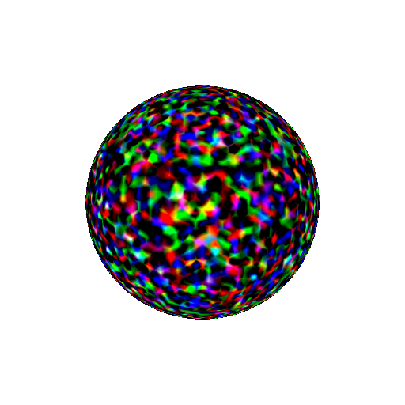
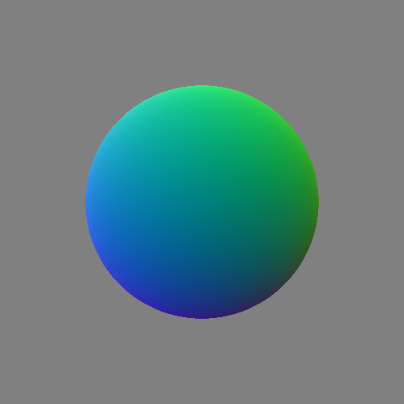
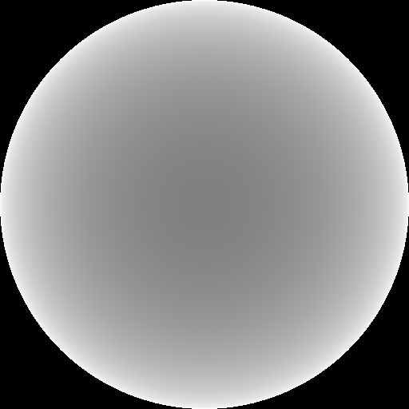

<div align="center">

<h1>An efficient render repo based on pytorch3d.</h1>
</div>

# Install

- Install the torch version you want, and find correponding pytorch3d in [link](https://mirrors.tuna.tsinghua.edu.cn/anaconda/cloud/pytorch3d/linux-64).

```
pip install torch==1.10.0+cu113 torchvision==0.11.1+cu113 torchaudio==0.10.0+cu113 -f https://download.pytorch.org/whl/torch_stable.html
wget https://mirrors.tuna.tsinghua.edu.cn/anaconda/cloud/pytorch3d/linux-64/pytorch3d-0.7.4-py38_cu113_pyt1100.tar.bz2;
pip install fvcore;
pip install iopath;
conda install --use-local pytorch3d-0.7.4-py38_cu113_pyt1100.tar.bz2;
```

- When you have runnable `torch` and `pytorch3d`, install this repo using pip:

```
pip install git+https://github.com/WenjiaWang0312/torch3d_render.git
```

# Important tools

## load, combine, trasnform and save meshes

```python
from t3drender.mesh_utils import load_plys_as_meshes, save_meshes_as_plys, load_objs_as_meshes, save_meshes_as_objs, join_meshes_as_scene, join_meshes_as_batch, join_batch_meshes_as_scene
from t3drender.transforms.affine import transform_points

# load
device = torch.device('cuda')
meshes = load_plys_as_meshes(ply_path, device) # 1, V, 3
meshes = load_plys_as_meshes([ply_path1, ply_path2], device) # 2, V, 3
save_meshes_as_plys([ply_path1, ply_path2], meshes)

# combine
sphere_mesh = ico_sphere(5, device) # 1, V, 3
meshes = join_meshes_as_scene([sphere_mesh, sphere_mesh]) # 1, 2V, 3
batch_sphere = joint_meshes_as_batch([sphere_mesh, sphere_mesh]) # 2, V, 3
meshes = joint_batch_meshes_as_scene([batch_sphere, batch_sphere]) # 2, 2V, 3

# transform
T = torch.eye(4, 4)[None].to(device)
sphere_mesh = sphere_mesh.update_padded(transform_points(sphere_mesh.verts_padded(), T))

# save
save_meshes_as_objs('1.obj', sphere_mesh)
save_meshes_as_objs(['1.obj', '2.obj'], batch_sphere)
```

## conversion

```python

```

## Cameras

# Examples

## Render Mesh

```python
import torch
import numpy as np
from pytorch3d.utils import ico_sphere
from t3drender.render.render_functions import render_rgb
from pytorch3d.renderer.mesh.textures import TexturesVertex
import cv2
device = 0
# or
device = torch.device("cuda:0" if torch.cuda.is_available() else "cpu")

# You need to konw where to put your meshes
meshes = ico_sphere(5, device)
moved_verts = meshes.verts_padded()
moved_verts[..., 2] += 2
meshes = meshes.update_padded(moved_verts)

# The default camera setting does not set extrinsic matrix, for advanced camera setting you need to feed R, T matrix into cameras
meshes.textures = TexturesVertex(torch.randn_like(meshes.verts_padded()))
image_tensors = render_rgb(meshes, device=device, resolution=(512, 512), fov=90, batch_size=30, verbose=True)
image = image_tensors[..., :3].detach().cpu().numpy() * 256
cv2.imwrite('sphere.png', image[0])
```


<div style="text-align: left;">

</div>


## render multi gpu

```python
import torch
import numpy as np
from pytorch3d.utils import ico_sphere
from t3drender.render.render_functions import render_rgb
from pytorch3d.renderer.mesh.textures import TexturesVertex
import cv2

device = [0, 1, 2]
# or
device = [torch.device('cuda:0'), torch.device('cuda:1'), torch.device('cuda:2')]

# You need to konw where to put your meshes
meshes = ico_sphere(5, device)
meshes = meshes.extend(100)
moved_verts = meshes.verts_padded()
moved_verts[..., 2] += 2
meshes = meshes.update_padded(moved_verts)

# The default camera setting does not set extrinsic matrix, for advanced camera setting you need to feed R, T matrix into cameras
meshes.textures = TexturesVertex(torch.randn_like(meshes.verts_padded()))
meshes = meshes.extend(100)
image_tensors = render_rgb(meshes, device=device, resolution=(512, 512), fov=90, batch_size=5, verbose=True)
image = image_tensors[..., :3].detach().cpu().numpy() * 256
```

## Render Normal

```python
import torch
import numpy as np
from pytorch3d.utils import ico_sphere
from t3drender.render.render_functions import render_normal
import cv2
device = 0

# You need to konw where to put your meshes
meshes = ico_sphere(5, device)
moved_verts = meshes.verts_padded()
moved_verts[..., 2] += 2
meshes = meshes.update_padded(moved_verts)

# The default camera setting does not set extrinsic matrix, for advanced camera setting you need to feed R, T matrix into cameras
image_tensors = render_normal(meshes, device=device, resolution=(512, 512), fov=90, batch_size=30, verbose=True)
image_tensors = image_tensors / 2 + 0.5
image = image_tensors[..., :3].detach().cpu().numpy() * 256
cv2.imwrite('sphere.png', image[0])
```

<div style="text-align: left;">

</div>

## Render Depth

```python
import torch
import numpy as np
from pytorch3d.utils import ico_sphere
from t3drender.render.render_functions import render_depth_orthographic
import cv2
device = torch.device("cuda:0" if torch.cuda.is_available() else "cpu")

meshes = ico_sphere(5, device)

# The default camera setting does not set extrinsic matrix, for advanced camera setting you need to feed R, T matrix into cameras
image_tensors = render_depth_orthographic(meshes, device=device, resolution=(512, 512), batch_size=30, verbose=True)
image_tensors = image_tensors / image_tensors.max()
image = image_tensors[..., :3].detach().cpu().numpy() * 256
cv2.imwrite('sphere.png', image[0])
```

<div style="text-align: left;">

</div>

## Render PointCloud

```

```

## Render Silhouette

```python
import torch
import numpy as np
from pytorch3d.utils import ico_sphere
from t3drender.render.renderers import SilhouetteRenderer
from t3drender.render.shaders import SilhouetteShader
from t3drender.render.render_runner import render_mp
from t3drender.cameras import PerspectiveCameras
import cv2
device = torch.device("cuda:0" if torch.cuda.is_available() else "cpu")

# Create mesh
meshes = ico_sphere(5, device)
moved_verts = meshes.verts_padded()
moved_verts[..., 2] += 2
meshes = meshes.update_padded(moved_verts)

# Setup camera
resolution = (512, 512)
focal_length = 512
h, w = resolution
K = torch.eye(3, 3)[None]
K[:, 0, 0] = focal_length
K[:, 1, 1] = focal_length
K[:, 0, 2] = w / 2
K[:, 1, 2] = h / 2
cameras = PerspectiveCameras(in_ndc=False, K=K, convention='opencv', resolution=resolution)

# Render silhouette
silhouette_renderer = SilhouetteRenderer(resolution=resolution, shader=SilhouetteShader())
silhouette_images = render_mp(
    renderer=silhouette_renderer, 
    meshes=meshes, 
    batch_size=1, 
    verbose=True, 
    cameras=cameras, 
    device=device
)

# Save result
silhouette_data = silhouette_images[0, ..., 3].detach().cpu().numpy()  # Alpha channel
silhouette_normalized = (silhouette_data * 255).astype(np.uint8)
cv2.imwrite('silhouette.png', silhouette_normalized)
```

## Render Segmentation Mask

```python
import torch
import numpy as np
from pytorch3d.utils import ico_sphere
from t3drender.render.render_functions import render_segmentation
from pytorch3d.renderer.mesh.textures import TexturesVertex
import cv2
device = torch.device("cuda:0" if torch.cuda.is_available() else "cpu")

# Create meshes with different instance IDs
meshes = ico_sphere(5, device)
moved_verts = meshes.verts_padded()
moved_verts[..., 2] += 2
meshes = meshes.update_padded(moved_verts)

# Set instance ID texture (ID = 1)
id_texture = torch.ones_like(meshes.verts_padded()) * torch.tensor([1.0, 1.0, 1.0], device=device)
meshes.textures = TexturesVertex(id_texture)

# Render segmentation mask
mask_images = render_segmentation(meshes, device=device, resolution=(512, 512), fov=90, batch_size=1, verbose=True)
mask_data = mask_images[0, ..., 0].detach().cpu().numpy().astype(np.uint8)
cv2.imwrite('instance_mask.png', mask_data * 100)
```
